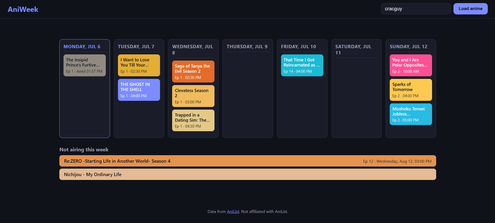
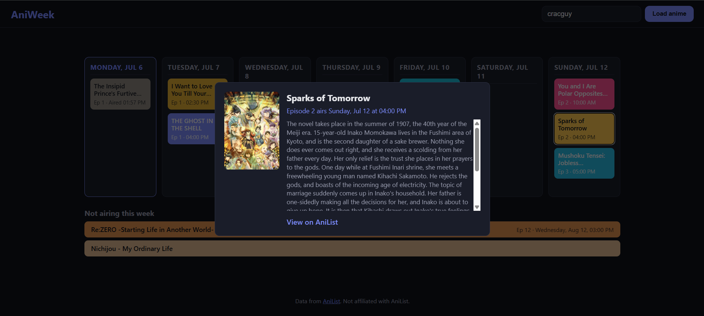

# aniweek

A little webapp for visualising when during the week anime which the user is watching are airing, using data from AniList.



*Demo image of the webapp interface*

## Features

- Topbar with username input + "Load anime" button — fetches the user's current "Watching" list from AniList
- Username is remembered (`localStorage`) and auto-loaded on your next visit
- Anime titles shown in English where AniList has one, falling back to romaji otherwise
- Week table showing the next 7 calendar days starting today, each column headed with weekday + date (e.g. "Monday, Jul 6"), anime shown as colored boxes positioned by actual next-airing date and time, converted to your local timezone
- Episodes that already aired earlier today are still shown in today's column (dimmed, labeled "Aired"), instead of disappearing once AniList's schedule ticks over to next week
- Today's column highlighted
- Anime not airing within the next 7 days (no upcoming episode, or next episode airs further out) shown as full-width bars below the week table, with their next known air date if any
- Boxes/bars colored using each anime's AniList cover color, with automatic text contrast
- All weekday/month names and times are rendered in English regardless of browser locale
- Click any box or bar to open a popup with title, cover image, description, airing info, and a link to AniList; click outside the popup (or press Escape) to close it
- No account, login, or backend required — all data comes live from the public AniList GraphQL API
- Favicon styled after the app's day-column boxes: two dark tiles with a bright blue outline, "A" and "W"



*Demo image of the details view*

## Usage

1. Open `index.html` in a browser (see Setup below for serving it locally).
2. Enter an AniList username in the topbar input.
3. Click "Load anime" to see that user's currently-watching anime arranged by air day/time, with non-airing anime listed below. Your username is remembered for next time.
4. Click any anime box/bar for details in a popup.

The AniList profile must be public for its watching list to be readable.

## Setup

This is a static site — no build step or dependencies.

Serve the project root with any static file server, for example:

```bash
npx serve .
# or
python -m http.server 8000
```

Then open the printed local URL in your browser.

Opening `index.html` directly via `file://` also works in most browsers since the app only makes external `fetch` calls to AniList's API.

See [ARCHITECTURE.md](ARCHITECTURE.md) for technical details.
